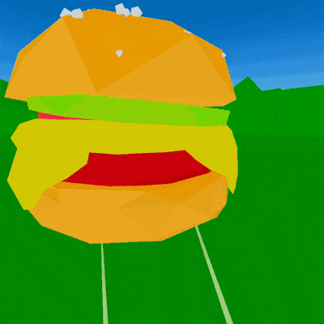
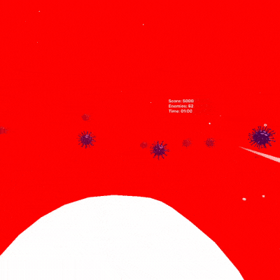
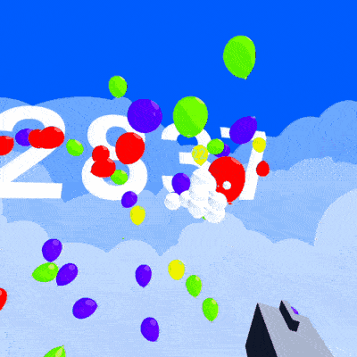

# VR ゲーム
最近、XR（VR/AR/MR）が人気推移を見せているので、
VRゲームを作りたかったです。
商業用ではなく趣味にしたので、
デモバージョンでのみ製作しました。

## 3. 5 秒 [VR ハンバーガー消費シミュレーター]

目標は、5 秒のタイマーが経過する前にハンバーガーが地面に落ちたときにそれを消費することです。

この VR ゲームは、「ドロヘドロ」や「ママと恋する理由」などのテレビ番組から大きな影響を受けています。

[Oculus Quest の APK をダウンロード](FiveSeconds/5sec.apk)

**ツール**:
* **音楽**: Beepbox
* **3D エディター**: Blender
* **ゲーム エンジン**: Unity 3D
* **プラットフォーム**: Oculus Quest

## 2. Paper Against Viruses [VR シューティング]

あなたは秘密医療組織の秘密エージェントです。組織はあなたを原子の塊のように小さくし、危険な未知の病気と戦うために送り込みました。それは別のパラレル ワールドから来たエイリアンであることが判明しました。

[Oculus Quest の APK をダウンロード](PaperAgainstViruses/PaperAgainstViruses.apk)

**ツール**:
* **音楽**: Ableton Live
* **ゲーム エンジン**: Unity 3D
* **プラットフォーム**: Oculus Quest

## 1. Apopalypse [VR シューティング]

これは風船との戦いに関する素晴らしい物語です。風船は人々の魂を吸い取って膨らませます。あなたの使命は、風船が膨らまないように阻止することです。

[Oculus Quest の APK をダウンロード](Apopalypse/Apopalypse.apk)

**ツール**:
* **音楽**: Garage Band
* **サウンド FX**: Apple のボイスメモ
* **ゲーム エンジン**: Unity 3D
* **プラットフォーム**: Oculus Quest
